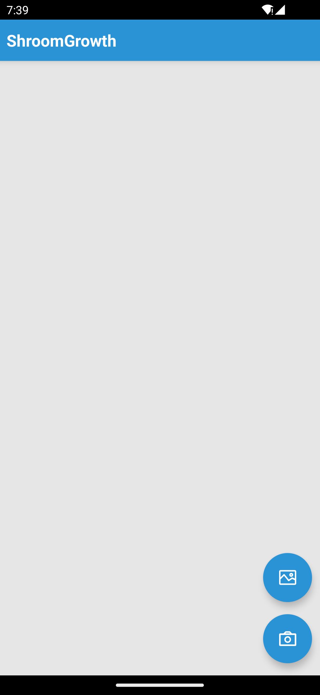
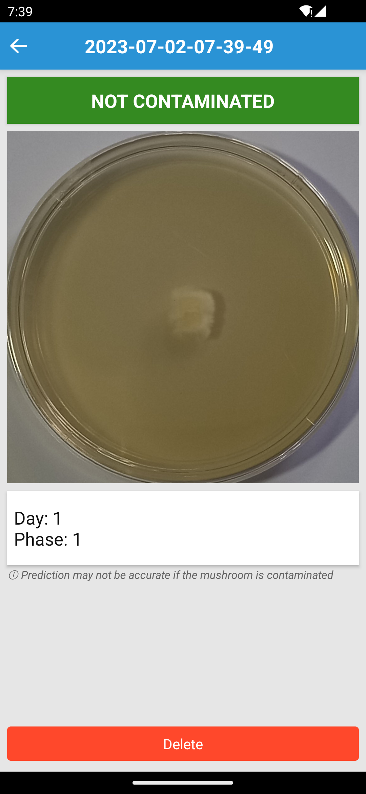
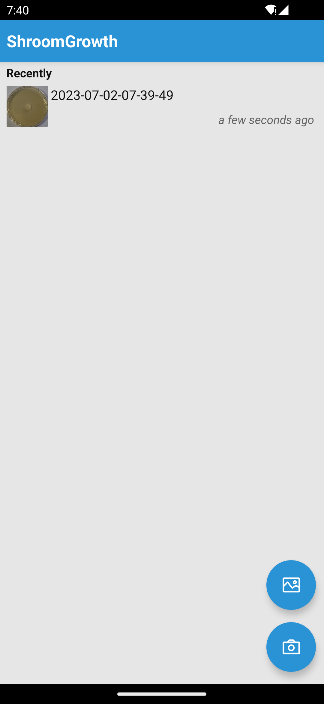

# ShroomGrowth 🍄
An AI-powered scanner on Android to identify growth phase and contamination of rhizomorphic mycelium powered by Ignite.

# Screenshots
||||
|:-:|:-:|:-:|

## Note
Currently developed with Expo SDK 45 with custom native Android modules.
